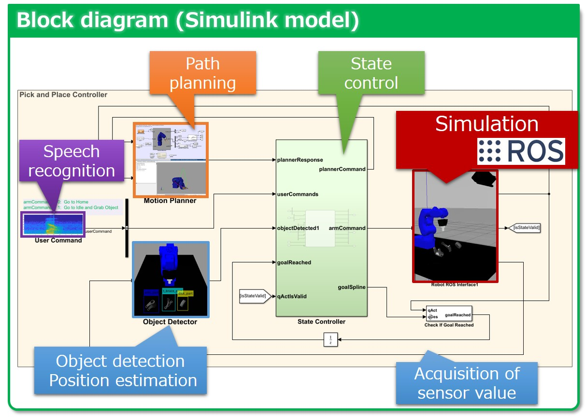

# Matlab_ROS_PickPlace
Pick &amp; Place application by integrating Matlab &amp; ROS

You can also access the summary of the application from [MATLAB File Exchange](https://jp.mathworks.com/matlabcentral/fileexchange/72144-matlab_ros_pickplace).



## Usage
1. Turn off all anti-virus software and firewalls before running
2. Install ROS Kinetic Kame + Gazebo v7 on Ubuntu Linux 16.04 (or VMware etc)
   - http://wiki.ros.org/kinetic/Installation/Ubuntu
   - http://projectsfromtech.blogspot.com/2017/09/installing-ros-on-virtual-machine-for.html
3. Create catkin workspace in home directory etc
```sh
$ mkdir ~/catkin_ws_motomini
$ mkdir ~/catkin_ws_motomini/src
$ cd ~/catkin_ws_motomini/src
$ catkin_init_workspace
$ git clone https://github.com/ntl-ros-pkg/motoman_apps.git
$ cd motoman_apps
$ sh install.sh
$ source ~/catkin_ws_motomini/devel/setup.bash
```
4. Execute XACRO to generate URDF (convert COLLADA (.dae) to STL)
```sh
$ cd ~/catkin_ws_motomini/src/motoman_pkgs/motoman_robot/motoman_description
$ rosrun xacro xacro --inorder motomini_with_gripper.urdf.xacro > ~/motomini_with_gripper.urdf
$ sudo apt install openctm-tools
$ find . -name '*.dae' | sed 's/.dae$//' | xargs -i ctmconv {}.dae {}.stl    
 # (However, since some COLLADA files are not converted correctly, those with a capacity of 0 are converted manually to STL using Blender etc.) 
$ sed -i 's/.dae/.stl/g' ~/motomini_with_gripper.urdf 
```
5. Copy one file and one folder under the ROSFiles folder for MATLAB (If you get files from Ubuntu to Windows, use WinSCP etc.)
   - `~/motomini_with_gripper.urdf`
   - `~/catkin_ws_motomini/src/motoman_pkgs/motoman_robot/motoman_description`
6. Launch the Motomini simulation environment
```sh
$ source ~/catkin_ws_motomini/devel/setup.bash
$ roslaunch motoman_mathworks_apps motomini_picking_demo_gazebo_autorun.launch
```
7. Start MATLAB R2019a or later
8. Replaced the built-in Indigo message with Kinetic
   1. Install "Robotics System Toolbox Interface for Custom Messages" from Add-on Explorer.
      - Add-on Explorer is started with the following command.
         ```MATLAB
         >> roboticsAddons
         ```
   1. Download the gazebo_msgs package from below
      - https://github.com/ros-simulation/gazebo_ros_pkgs
      - use `kinetic-devel`
   2. Extract to custommsg under the ROSFiles folder
      - `ROSFiles/custommsg/gazebo_msgs`
      - `ROSFiles/custommsg/gazebo_msgs/msg`
      - `ROSFiles/custommsg/gazebo_msgs/srv`
      - `ROSFiles/custommsg/gazebo_msgs/package.xml`
   3. Run `rosgenmsg` in MATLAB
      ```MATLAB
      >> rosgenmsg(fullfile(pwd,'ROSFiles','custommsg'))
      ```
   4. Edit the javaclasspath.txt file according to the message displayed on the command line. 
      - Put a "before" token at the beginning of the line to use the new one instead of the existing JAR file.
         ```xml
         <before>
         c:\Yaskawa_MotoMini\ROSFiles\custommsg\matlab_gen\jar\gazebo_msgs-2.5.8.jar
         ```
      - Add to MATLAB path as below
         ```MATLAB
         >> addpath(fullfile(pwd,'ROSFiles','custommsg','matlab_gen','msggen'))
         >> savepath
         ```
   5. Restart MATLAB
   6. Delete the previously generated file and regenerate it
      ```MATLAB
      >> rmdir(fullfile(pwd,'ROSFiles','custommsg','matlab_gen','msggen','+robotics','+ros','+custom','+msggen','+gazebo_msgs'), 's')
      >> rosgenmsg(fullfile(pwd,'ROSFiles','custommsg'))
      ```
9. Run startupDemo.m in demo folder (PickAndPlaceDemo)
10. Click "MATLAB / Simulink: Pick & Place Application" in the browser
11. When showCompleteDemo.m opens, change the IP address on line 14 to the IP address of the machine on which Ubuntu 16.04 is installed
12. Open the mainController Simulink model below in the command window
   ```MATLAB
   >> open_system('mainController');
   ```
13. Run showCompleteDemo.m
14. Execute with Simulink execution button of mainController, which invoke pick and place

## Required Toolbox
- MATLAB R2019a
- Robotics System Toolbox
- Image Acquisition Toolbox
- Image Processing Toolbox
- Computer Vision Toolbox
- Statistics and Machine Learning Toolbox
- Deep Learning Toolbox
- Reinforcement Learning Toolbox
- Simulink
- Stateflow
- Simscape
- Simscape Multibody
- Optimization Toolbox
- Global Optimization Toolbox
- Parallel Computing Toolbox
- MATLAB Coder
- GPU Coder
- Simulink Coder
- Embedded Coder
- Aerospace Toolbox
- Aerospace Blockset
- Audio Toolbox
